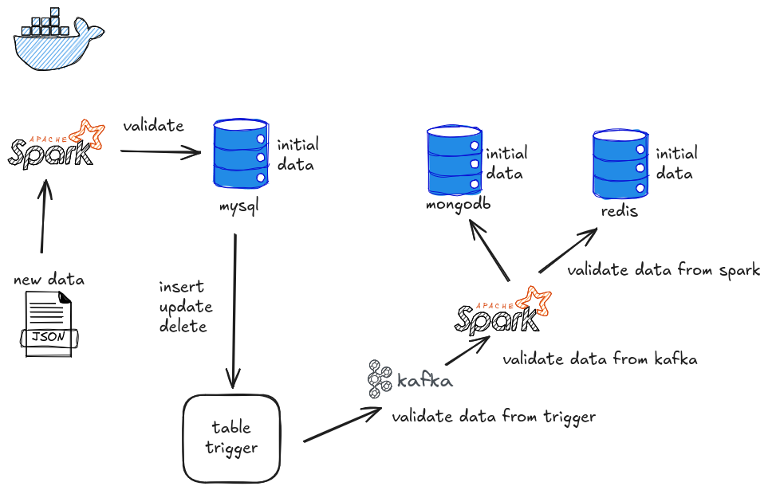

# Data Synchronization ETL Pipeline

## Overview
This GitHub project implements a real-time ETL (Extract, Transform, Load) pipeline designed to synchronize data between **MySQL**, **MongoDB**, and **Redis** using **Apache Kafka** for message queuing and **Apache Spark** for distributed data processing. The pipeline ensures low-latency data synchronization with comprehensive validation and consistency checks, focusing on Vietnam demographic data as an example use case.



## Features
- **Real-Time Data Synchronization**: Utilizes Spark Streaming to synchronize data across MySQL, MongoDB, and Redis in real-time.
- **Batch Processing**: Employs Spark for transforming large datasets with validation before storage.
- **Data Validation**: Implements logic to validate incoming messages and transformed data at multiple stages.
- **Data Consistency Checks**: Ensures integrity by comparing producer/consumer counts and write/read operations.
- **Multi-Database Integration**: Seamlessly synchronizes data between MySQL, MongoDB, and Redis.

## Architecture
- **Apache Kafka**: Two Kafka servers (Kafka server 1 and Kafka server 2) manage message queues. Kafka validate logic runs within Docker containers to preprocess messages.
- **Docker**: Provides containerized environments for Kafka and validation logic, ensuring portability and scalability.
- **Apache Spark**: Powers both streaming and batch processing. Spark Streaming handles real-time synchronization, while batch processing transforms and validates data.
- **Databases**:
  - **MySQL**: Serves as an intermediate data store for transformation and initial data extraction.
  - **MongoDB**: Stores processed batch data for long-term persistence.
  - **Redis**: Acts as a caching layer for frequently accessed synchronized data.

## Project Structure
```
├── assets/                 
├── config/                
├── Data/                  
├── database/             
├── kafka-docker/          
├── lib/                 
├── sql/                  
├── src/
│   ├── ETL/               
│   └── spark/            
├── main.py                
├── README.md              
├── requirements.txt       

```

**Prerequisites**: Install the following dependencies:
   - Docker
   - Apache Kafka
   - Apache Spark
   - MySQL
   - MongoDB
   - Redis
   - Python 3.9+


**Configuration**:
   - Set up Kafka servers with appropriate topics and partitions using `kafka-docker/create-topics.sh`.
   - Configure Spark cluster with master and worker nodes using `config/spark_config.py`.
   - Adjust database connection strings in `config/database_config.py` for MySQL, MongoDB, and Redis.

## Project Logic in Detail
The pipeline's logic is designed to extract data from MySQL, transform it using Spark, and load it into MongoDB and Redis with real-time synchronization. Below is a detailed breakdown:

### **1. Batch Processing – Validation Writing to MySQL**

* **Data Loading**
  Spark reads data. Assumption, input data is already cleaned.

* **Validation After Writing**
  * Row count consistency between Spark and MySQL.
  * Data value integrity (e.g., field totals, key uniqueness).

* **Write-Read Count Consistency Check (Δ = Write - Read)**

  * Compare the number of records written to MySQL and read back
  * **If Δ = 0** → the record count is consistent
  * **If Δ ≠ 0** → inconsistency is detected, triggering recovery or reprocessing

* **Data Content Verification**

  * Compare the actual content of written and read records
  * **Only if the content matches exactly**, the data is considered fully valid

---

### **2. Real-Time Processing – Kafka Message Validation**

* **Message Ingestion**
  Data is streamed from the source into Kafka for real-time processing.

* **Producer-Consumer Count Consistency Check (Δ = Producer - Consumer)**

  * Compare the number of messages produced and consumed from Kafka
  * **If Δ = 0** → the message count is consistent
  * **If Δ ≠ 0** → inconsistency detected, triggering retries or alerts 

* **Message Content Verification**

  * Compare each message's content between producer and consumer
  * **Only when content matches exactly**, the message is accepted as valid and stable


## License
This project is licensed under the [MIT License](LICENSE).