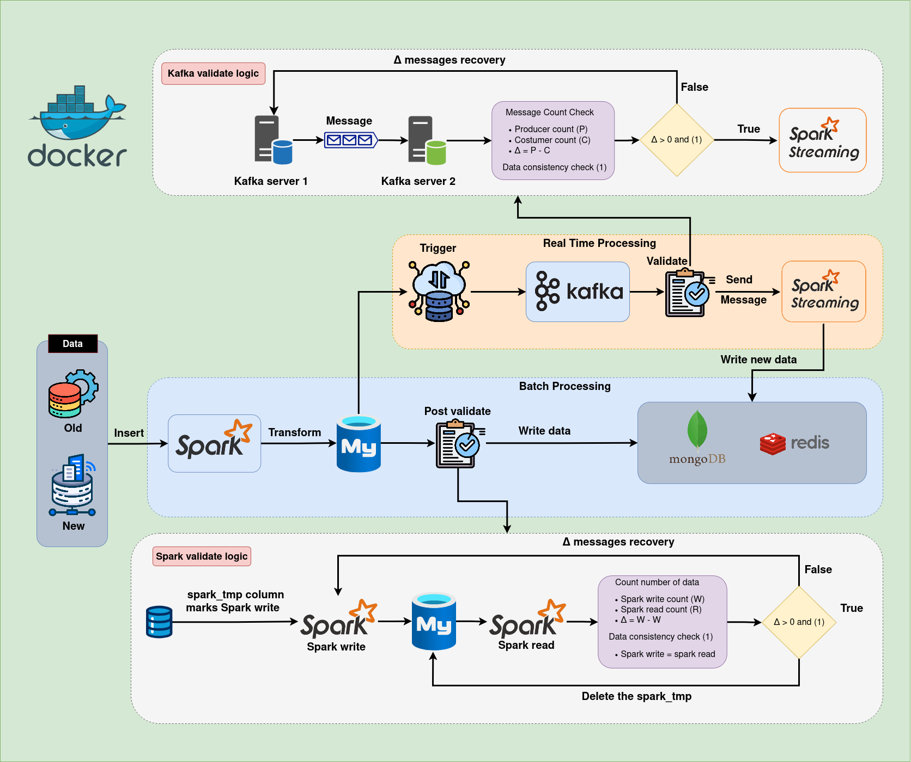

# Data Synchronization ETL Pipeline

A real-time ETL pipeline to synchronize data between **MySQL**, **MongoDB**, and **Redis** using **Apache Kafka** and **Apache Spark**. This project was mentored by Đạt Đặng.

## Overview
This project captures data changes from MySQL via triggers, streams them through Kafka, processes and transforms data with Spark, and synchronizes results to MongoDB and Redis. It ensures data quality and runs continuously.



## Features
- **Real-time Sync**: Keeps MySQL, MongoDB, and Redis in sync with low latency.
- **Modular Design**: Organized codebase for easy maintenance and scalability.
- **Data Validation**: Multi-stage checks for data consistency.
- **Tech Stack**: Python, Apache Spark, Apache Kafka, MySQL, MongoDB, Redis, Docker, Linux.

## Project Structure
```
├── config/                # Database and Spark configurations
├── database/              # Database connectors (MySQL, MongoDB, Redis)
├── src/                   # ETL logic (Kafka consumer, Spark processing)
│   ├── ETL/
│   ├── spark/
├── Data/                  # Temporary/test data
├── lib/                   # Utility functions
├── sql/                   # SQL scripts for MySQL triggers
├── README.md              # Project documentation
├── requirements.txt       # Python dependencies
```

## Usage
- The pipeline captures MySQL changes, streams them via Kafka, processes with Spark, and writes to MongoDB/Redis.
- Monitor Kafka lag and Spark job status for performance.

## Results
- Achieves real-time data synchronization with high reliability.
- Modular and scalable for additional data sources or targets.

## License
MIT License